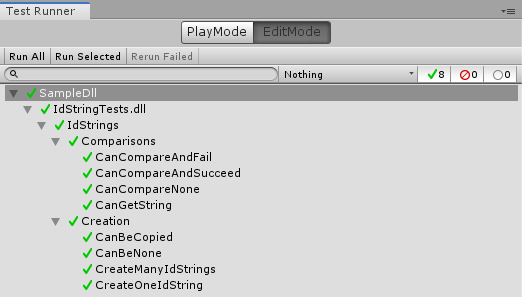

# Id Strings

This library adds simple and efficient indexed strings for **C++** and **Unity**.

## Indexed Strings

An Indexed String is a data type that represents an **String** but is **faster to compare and copy**, and is **smaller** in memory. However, it is slightly more expensive to create.

Both in Cpp and Unity you will find the struct **IdString**. It can be created from an string and doesn't need any setup.

## Technical Explanation

When an **IdString** is created or assigned from an string or const char*, its hash value is stored and a copy of the string is saved on a global table.

That is why an IdString only needs 8 bytes, and why comparing it is very fast (we are only checking that two integers match).

To return the string value, the table will find the hash we have and return it as a const String&. If the IdString was null, then the returned string is an static none value. This is done to avoid copying any strings.

Because of its size (8 bytes), it is recommended that this type is always **passed by value** and **copied**.

## Serialization

In **Cpp** serialization is not implemented in favor of any custom solution the user may have. It's recommended to store it as an string value.

In **Unity** an IdString is serialized as an string directly. (It also has the benefit that debugging it it considerably easier)

## ToDo

There's one single main feature missing which is the removal of unused strings from the table. This is usually not a problem because strings are never duplicated on the table, but if we are constantly generating different names, the table won't free them.

## Tests

The associated Unity project has tests for this library:

## Why

Developed for ESNE Development and Design of Videogames degree by Miguel Fernández Arce.